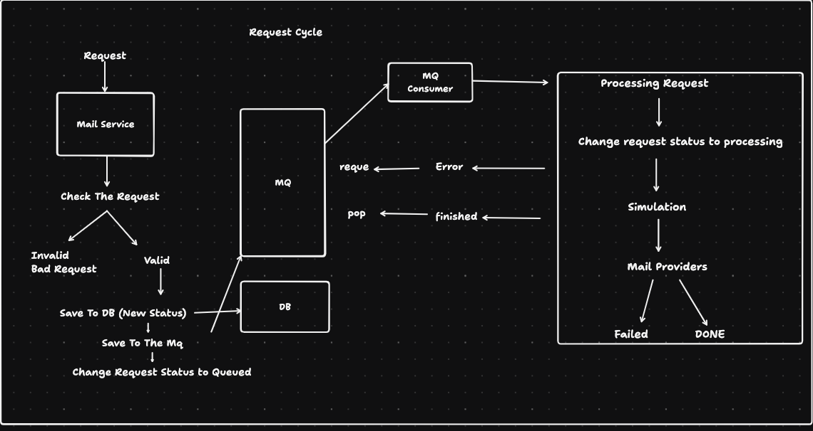
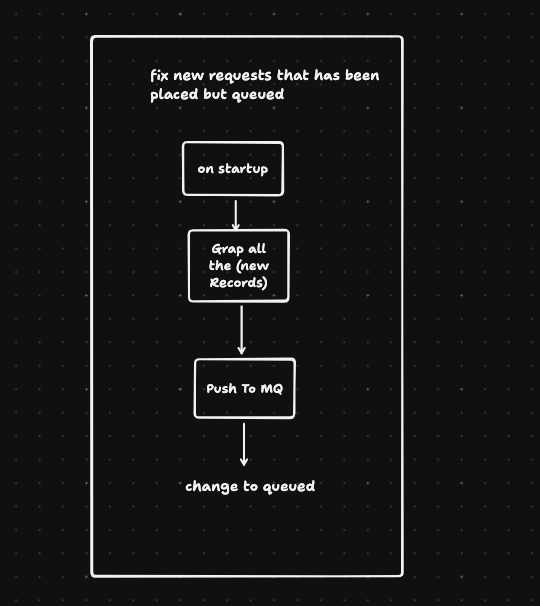

# Email Microservice

## Overview

This project is a RabbitMQ-based microservice built with NestJS for handling email requests. It allows users to send emails asynchronously by pushing requests onto a message queue, which are then processed by the microservice.

## Features

- Asynchronous email sending using RabbitMQ
- API documentation using Swagger
- Support for retrying failed email requests
- Handles new email requests with automatic status updates
- Structured logging for better debugging and monitoring

## Graph




## Technologies Used

- NestJS
- RabbitMQ
- TypeORM
- Swagger

## Installation

1. Clone the repository:

   ```bash
   git clone <repository-url>
   ```

2. Navigate to the project directory:

   ```bash
   cd <project-directory>
   ```

3. Install the dependencies:

   ```bash
   npm install
   ```

4. Set up your environment variables as needed, including RabbitMQ configurations (username, password, host, port).

## Usage

### Starting the Service

To start the microservice, run the following command:

```bash
npm run start
```

### API Documentation

You can access the API documentation at:

```
http://localhost:<PORT>/docs
```

## How It Works

1. The microservice listens for incoming email requests through the `/mail/send` endpoint.
2. Once a request is received, it is processed, and the email data is saved to the database.
3. The email request is emitted to a RabbitMQ queue to be handled by the Mail Consumer Service.
4. The Mail Consumer Service picks up the messages from the queue and processes them, updating the status of each request accordingly.

## Contributing

Contributions are welcome! Please fork the repository and submit a pull request.

## License

This project is licensed under the [MIT License](LICENSE).

## Acknowledgments

- NestJS team
- RabbitMQ documentation
- Related libraries used in the project
